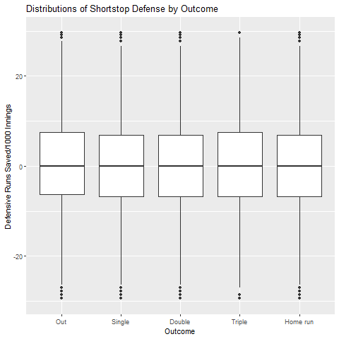
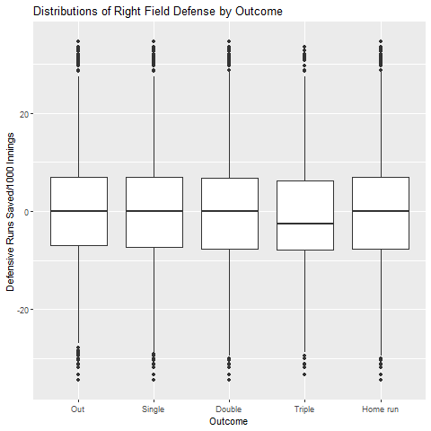

```{r setup, include=FALSE}
knitr::opts_chunk$set(echo = TRUE)
```

## Introduction

Readers already familiar with the sport of baseball may prefer to skip to "Project aim."

### What is baseball?

Baseball is a bat-and-ball sport whose modern form originated in the United States in the nineteenth century. It is closely related to bat-and-ball sports of European origin, such as cricket.

While baseball enjoys popularity in many nations (mostly in the Americas and Japan), the United States' Major League Baseball (MLB), founded in 1903, is recognized as the world's premier baseball league. MLB is composed of two "leagues", the National and American Leagues, each divided into three divisions; East, Central and West. There are 30 teams in the MLB, of which 29 are based in the United States and one in Canada. At the conclusion of each baseball season (played roughly from early April to late October), the champions of the National League and the American League compete against each other in a best-of-seven "World Series."

### Rules of baseball

The rules of baseball may be found at http://mlb.mlb.com/documents/0/8/0/268272080/2018_Official_Baseball_Rules.pdf. What follows is a brief summary of the aspects of the sport necessary to understand the project at hand. Note that for clarity, throughout this paper male pronouns are used when a singular pronoun is called for. (There has never been a female player in the MLB, the organization of interest in this study.)

A baseball game, under normal circumstances, consists of 9 "innings". For the first half of each inning, the away team plays offense and attempts to score while the home team plays defense and attempts to prevent scoring. These roles are reversed in the second half of each inning. The team with the most runs (points) at the end of nine innings wins the game. "Extra" innings are played if necessary to break ties.

Throughout the game, nine players of the offensive team take turns, one at a time, "at-bat." They stand opposite the opposing "pitcher" and eight other defensive players, carrying a bat. The pitcher throws the ball towards the batter, trying to get the batter "out." The batter, for his part, attempts to hit the ball with the bat and "reach base". As the inning continues, the offensive players who have reached base attempt to touch each of the four bases in order, wihtout getting out. If an offensive player successfully touches the fourth base, "home plate," his team is awarded one run.

When a pitch has been thrown, if the batter swings and misses, or fails to swing at a pitch that is deemed by the umpire to be within the "strike zone," this is a "strike." If there are three strikes against a batter, he is "out" and another teammate becomes the next batter. When a team has recorded three outs, the half-inning is over and the opposing team comes to bat.

A batter may avoid "striking out" either by walking (the batter is awarded first base if the pitcher throws four pitches outside of the strike zone without the batter swinging), or by making contact with the ball and putting it "in play." Even if a batter puts a ball in play, he may still get "out," mainly in the following ways: the batted ball is caught on the fly, the batter is tagged by a defensive player with the ball while not on a base, or a defensive player with the ball touches first base before the batter (now the "batter-runner") has touched first base. While the batter is not out, he is free to touch as many bases as he can in order; he generally elects to stop at the farthest base possible without getting out, at which point he is safe and cannot get out until he leaves the base on a subsequent play.

If a batter reaches base, he may stop at first base, second base, third base or home plate. Ignoring some technicalities, those results are designated as a single, double, triple, or home run, respectively. If a batter gets on base but does not reach home plate (i.e., he does not score), he may still be able to reach home plate when a new teammate at-bat puts the ball in play. Clearly, for a given at-bat, a home run is the best option, followed in order by triple, double, and single. 

The rules governing play beyond this are complex, but they are not crucial to understand the project at hand. 

### Baseball statistics and wOBA

Baseball statistics have been recorded and studied for well over one hundred years. Possibly due to the fact that individual actions are relatively easily separable in baseball (i.e., teammates have less of an effect on each other's individual outcomes than in other sports), baseball has also perhaps been the sport most responsible for the origination and explosion of advanced sports analytics, whereby analysts identify measured player accomplishments that are most likely to translate to runs and wins and apply sophisticated statistical methods to make predictions and inferences about such quantities. A pioneer of this work in the late 20th century was Bill James, honored as one of Time Magazine's 100 most influential people in the world for 2006. Advanced baseball statistics, often known as "sabermetrics," entered into popular culture with Michael Lewis's 2003 bestseller *Moneyball: The Art of Winning an Unfair Game* about the Oakland Athletics' adoption of sabermetric principles, later adapted into the Oscar-nominated 2011 film *Moneyball*.

In this project, we are going to focus on the [sabermetric statistic *wOBA*](https://library.fangraphs.com/offense/woba/), which stands for "weighted on-base percentage." For a given sequences of a batter's plate appearances, is calculated as follows:

\[
wOBA = \frac{0.7\cdot(BB+HBP)+0.9\cdot S+1.25\cdot D+1.6 \cdot T+2 \cdot HR}{PA-SacB}
\]

where BB is the number of walks, HBP is the number of times hit-by-pitch (same outcome as walk), S is the number of singles, D is the number of doubles, T is the number of triples, HR is the number of home runs, PA is the number of plate appearances, and SacB is the number of sacrifice bunts. The weights in the numerator are calculated so as to represent the number of additional runs scored that can be expected by a given batting outcome, relative to that batter instead getting out. The denominator normalizes the statistic to account for the fact that some batters have more opportunities to hit (plate appearances) than others. (Sacrifice bunts are a technicality that can be ignored for the purposes of understanding.) 

Therefore, $wOBA$ may be seen as a kind of "gold-standard" batting statistic; a player's $wOBA$ represents a relative measure of how many runs he tends to contribute each time he goes to bat.

*wOBA* weights vary slightly from year-to-year, but for the purposes of this project we use weights that are displayed in the Baseball Savant data set where the data was obtained. Additionally, *wOBA* often includes inputs from the baserunning event, stolen bases. In this project we do not considering these events. Note that this means that our calculations of true *wOBA* may differ slightly from those published on popular baseball statistic websites.

### Project aim

Although $wOBA$ is a very useful statistic because it attempts to tie batter outcomes directly to run production, it is still "outcome-oriented" in that it is purely a function of the batter's game-recorded outcomes. Outcome-oriented statistics are convenient and justifiable in the longterm, but they are not necessarily optimal for player evaluation and the prediction of future results.

As an analogy, imagine a novice poker player facing off against a professional. Since the game of poker has elements of both luck and skill, it is possible for the novice to beat the professional in a given match. An outcome-oriented analysis would conclude that the novice *played better* than the professional. But an informed observer would likely be able to recognize that the professional's decisions throughout the game were actually superior, and he just happened to be unlucky. In much the same way, a batter's recorded outcomes (single, double, etc.) are the result both of his own actions (hitting the ball and running), and factors outside of his control (defensive quality and stadium factors). 

In 2015, a new technology called [Statcast](https://en.wikipedia.org/wiki/Statcast) was introduced to Major League Baseball stadiums. The tool uses high-speed cameras to take measurements of ball and player movements during a game. Statcast produces a robust set of data about each baseball play, providng a large quantity of data that can be used to evaluate players in ways qualitatively different from what has been previously possible.

Using Statcast data, we may be able to identify the value of *batter-based* actions, we might arrive at an expectation of *wOBA* that is a more accurate indicator of batter quality than *wOBA* itself, which only considers the outcomes of each play.

This concept is not new; the analytics firm at Statcast calculates a statistic called [*xwOBA*](http://m.mlb.com/glossary/statcast/expected-woba), short for "expected wOBA," which attempts to determine the *wOBA* that could be expected from the batter's contact with the ball, as measured by launch speed, or the velocity at which the ball leaves the bat, and launch angle, or the vertical angle at which the ball leaves the bat. However, to our knowledge the algorithm used to calculate the statistic is not publicly available. We calculate our own version of expected wOBA which uses many more variables than what Statcast claims to. We believe that one of these variables, sprint speed, should add value to the model because it is a batter-level variable that is an important factor in whether a given batted ball is converted into a single, double, or triple. Another factor that we believe will be important is spray angle, which is an engineered feature that approximates the horizontal angle describing the direction in the field that the ball was hit. We also include other variables *outside* the batter's control and attempt to marginalize over their league-distribution. It is debatable whether such a procedure should produce better predictions of *wOBA* than simply omitting those variables from the beginning, but including them allows us to answer independent questions of interest with regard to what external factors affect batting outcomes.

The intended audience for this project ranges from baseball fans interested in learning more about baseball and what factors influence each play to baseball analysts who are interested in creating increasingly valuable methods in evaluating batter performance.

### Data 

$554,149$ samples of baseball event data are collected from [Baseball Savant](https://baseballsavant.mlb.com/statcast_search). For this investigation, we are interested in event-related batted ball-outcomes; that is, those at-bats that end with either i) an out , ii) a single, iii) a double, iv) a triple, or v) a home run. (Technically, an event recorded as an "out" may have been a fielding error that allowed the batter to reach base.) $377,050$ ($68.6\%$) of the samples produced a batted ball event. Predictors of interest are broken into two categories: those that the batter controls at least partially, and those the batter does not control. $100\%$ of the dataset contains valid outcome variables, whereas $4.6\%$ of the dataset contains incomplete predictor rows. The dataset consists of of $239,521$ ($66.5\%$) of outs, $75,935$ ($21.1\%$) of singles, $24,345$ ($6.7\%$) of doubles, $2356$ ($.6\%$) of triples, and $17,624$ ($4.9\%$) of home runs. The predictors of interest are organized as follows:

1. Batter-Controlled Predictors
    + Launch Speed: The speed of the ball immediately after being hit.
    + Launch Angle: The angle of the ball's trajectory, relative the ground (altitude angle).
    + Spray Angle: The angle of of the ball's trajectory, relative the batter's forward perspective towards the pitcher (azimuth angle). This feature was approximated using a coordinate system of where the ball was fielded. This was accomplished using a formula from a contributor at [The Hardball Times](https://tht.fangraphs.com/research-notebook-new-format-for-statcast-data-export-at-baseball-savant/).
    + Strike Zone, Top: The height of the top of the batter's strike zone. (According to MLB rules, this is halfway between the batter's shoulders and the top of his pants.)
    + Strike Zone, Bottom: The height of the bottom of the batter's strike zone. (According to MLB rules, this is at the batter's knees.)
    + Ball/Strike Count: The current number of balls/strikes when the pitch was thrown.
    + Batting Handedness: The side of the plate from which the batter hits.
    + Sprint Speed: The top sprint speed of the batter measured from that season. This data was also acquired from [Baseball Savant](https://baseballsavant.mlb.com/sprint_speed_leaderboard) in a separate data set.
2. Non-Batter-Controlled Predictors
    + Release Position of Pitch (x/y/z): The position the ball is release from. (The *z*-axis is perpendicular to the ground. The *y*-axis is the forward perspective of the batter towards the pitcher. The *x*-axis is horizontal, running parallel to the front edge of home plate, or equivalently the line connecting first base and third base.)
    + Velocity of Pitch (x/y/z/cumulative): The velocity of the pitch.
    + Zone: The categorical zone in which the ball crosses the plate, split into 14 sectors in the *xz* plane.
    + Pitcher Throwing Handedness: The hand from which the pitcher throws.
    + Movement of Pitch (x, z): The relative drop of the pitch in the x and z dimensions.
    + Plate Location (x, z): The location at which the ball crosses the plate.
    + Runner Positions: Whether there are runners on $1^{st}$, $2^{nd}$, or $3^{rd}$ bases at the time of the at-bat.
    + Acceleration of Pitch (x/y/z): The acceleration of the pitch.
    + Effective Speed: The effective speed of the pitch, based on where the pitcher releases the ball.
    + Release Spin Rate: The spin rate of the pitch.
    + Release Extension: The extension point at which the pitch is released.
    + Pitch Number: Total number of pitches thrown in current plate appearance.
    + Pitch Name: The label of the pitch type (fastball, curveball, changeup, etc.).
    + Fielder Defensive Statistics: The defensive rating of each of the $9$ fielders. The statistic used for these variables is [Defensive Runs Saved (DRS)](https://library.fangraphs.com/defense/drs/) which measures how many runs above or below average a fielder contributes to their team. In this model, the DRS for the player at that position in that season was normalized to $1,000$ innings played. The DRS measurements were obtained from [fangraphs.com](https://www.fangraphs.com/leaders.aspx?pos=all&stats=fld&lg=all&qual=y&type=1&season=2019&month=0&season1=2019&ind=0&team=0&rost=0&age=0&filter=&players=0&startdate=&enddate=).
    + Score of Batter's Team: Score of the team the batter is on.
    + Score of Pitcher's Team: Score of the team the pitcher is on.
    + Infield Fielding Alignment: The label of the infield fielding strategy employed (standard, strategic, shift).
    + Outfield Fielding Alignment: The label of the outfield fielding strategy employed (standard, strategic, extra outfielder).
    + Inning Number: The number of the inning.
    + Inning Half: Whether it is the top or bottom of the inning.
    
In the data set, $360,967$ batted ball events contained complete data for all the predictors listed above. This subset of the data was used for model training.
  
    
## Exploratory analysis

### Launch Angle & Launch Speed

Since the advent of Statcast, launch angle and launch speed have widely been considered the best indicators of batted ball quality; some combinations of launch speed and angle are recognized to tend to produce particular outcomes. The relationship between launch speed, angle, and outcome is shown in the plot below.


In this plot, we color the outcome of each batted ball from 2017-2019 and plot them by their launch angle and launch speed. A launch angle of $0$ degrees indicates a batted ball hit exactly parallel with the ground, a launch angle of $-90$ degrees indicates a batted ball hit directly down toward the ground, and a launch angle of $90$ degrees indicates a batted ball hit directly upwards away from the ground. We can see that home runs tend to be hit between launch angles of $20$ and $40$ degrees and launch speeds near or above $100$ miles per hour.

### Spray Angle and Launch Speed

We also believe that spray angle, or the horizontal direction in the field that the batter hits the ball may be important in determining the outcome. The relationship between spray angle, launch speed, and outcome is shown in the plot below.


In Figure 2, we color the outcome of each batted ball from 2017-2019 and plot them by their launch angle and launch speed. A spray angle of $0$ degrees indicates a batted ball hit directly toward the pitcher's mound, a launch angle of $-45$ degrees indicates a batted ball hit directly toward third base, and a launch angle of $45$ degrees indicates a batted ball hit directly toward first base. One takeaway from this plot is that a relatively large mass of doubles occur from batted balls hit with launch speed near or above $90$ miles per hour and spray angle nearly directly toward first or third base.

### Sprint Speed

We also believe that the top sprint speed of a player may be important in their batted ball outcomes since a faster player might be able to reach a farther base given the same batted ball and fielding behavior. Below we display a plot of the densities of batter sprint speed for each batted ball outcome.


In Figure 3 we can see that the distribution of sprint speed is extremely similar for every type of batted ball outcomes except for triples, which generally result from batters who have higher top sprint speeds. Therefore, sprint speed may be a useful predictor only of triples, which we note are a rare outcome.

### Defense

Fielding (defense) quality may also influence outcomes; good fielders might limit batters to worse outcomes, all else equal. To visualize this relationship we created boxplots to observe the distribution of player DRS per $1,000$ innings (a measure intended to capture fielding quality) for each position across each of the outcomes. Shortstops are often considered the most important defensive position on the field, so below we display the distributions of shortstop DRS per $1,000$ innings for each batted ball outcome.



We can see that there is not a noticeable difference in these distributions for any batted ball outcome. In this plot we can see that the median DRS per $1,000$ innings is about $0$ for every batted ball outcome, and that each distribution is approximately symmetric. We created these plots for every position and observed similar results for each defensive position, with the exception of one.

Below we display the distributions of right fielders' DRS per $1,000$ innings for each outcome.



From this plot we can see that on triples, the median DRS per $1,000$ innings of the right fielder tends to be lower than on other batted ball events. This is fairly intuitive because the right fielder is the position furthest from third base, which is where the batter must reach in order to acheive a triple. So, right fielders who are less skilled or slower at getting to a batted ball in right field allow the batter a relatively long period of time to reach third base. As in the case of sprint speed, defensive quality (specifically of right fielders) may be useful only in predicting the rare outcome of triples.

### Stadium

Unlike in most sports, baseball stadiums are generally allowed to vary in their dimensions from place to place. For example, the Red Sox' stadium, Fenway Park, is famously home to the "Green Monster," a left-field wall much higher and much closer to the infield than is the case in any other ballpark. Additionally, climate may affect outcomes, as baseballs tend to travel farther through air at lower pressure. For those reasons, batted ball outcome may be associated with the stadium in which the game is being played.


This shows that there is considerable variability across Major League Baseball stadiums in the number of home runs that occur. This could of course also be influenced by other factors (such as the quality of the pitchers that pitch in the stadium most often), but note that by far the highest number of home runs occurs at the Colorado Rockies' Coors Field, which contains very thin air due to the city of Denver's high elevation.

Another interesting outcome to explore is the frequency of triples by stadium, since triples are often the result of fielders' misplaying batted balls as the bounce off of stadium walls in unexpected ways.


We observe a relatively high number of triples in a handful of stadiums, such as the stadiums in Arizona, Detroit, San Francisco, and especially Colorado.

## Model

For this analysis, we chose to employ a Random Forest that inputs the predictors described above to predict one of the five batted ball outcomes. In the Random Forest model, we only considered batted balls that contained values for all the predictors above. 

One reason for choosing a Random Forest is that many of the predictors are highly non-linear and interactive in their propensity to produce certain outcomes, so any kind of additive model would be inadequate without including many interaction and higher-order terms. (This fact is convincingly demonstrated by Figures 1 and 2.) Further, the Random Forest handles large feature spaces easily and with a relatively low danger of overfitting. This is important for our task at hand, since we want to discover interesting predictors out of the large set of cutting-edge measurements made available to us by Statcast, but we believe that most of the included features will be considerably less predictive than launch speed, launch angle, and spray angle.

### SPORF

The particular implementation of Random Forest employed is [SPORF](https://arxiv.org/abs/1506.03410), or Sparse Projection Oblique Randomer Forests. Traditional Random Forests build upon the axis-aligned decision tree: that is, the trees split only along features that exist within the feature space of the dataset of interest. By contrast, oblique decision trees extend the split criterion along one or more features. For a simple example, consider where we wish to predict whether it is raining today, based on the knowledge that it rained yesterday and it is forecasted to rain tomorrow. Each of these pieces of information is individually valuable, but the evidence they provide in conjunction may be considerably stronger. Of course, an axis-aligned decision tree may well be capable of generating trees that can recognize this particular pattern. However, as the feature space widens, the tree depth to identify these "oblique" tendencies in the feature space grow exponentially. Trees of substantial depth unfortunately tend to lose generalizability and have a tendency to overfit the sample data. Fortunately, numerous strategies (for example, [XGBoost](https://arxiv.org/abs/1603.02754)) have been introduced to generate "oblique" ensembles: random forests built upon decision trees wholse split criterions include linear combinations, rotations, and other transforms of the individual features. SPORF was developed to accomodate these oblique strategies, while providing many of the computational benefits of a traditional axis-aligned method (particularly, computational efficiency, insensitivity to a large proportion of noisy inputs, and interpretability). For these reasons, as well as the ease-of-use of `SPORF` in the `R` programming language and heavy `C` optimization, we choose to use `SPORF`s for our project.

The codebase for `SPORF` may be found at https://neurodata.io/sporf/.


### rfxwOBA

As stated above, we will use the results of the random forest model to produce our own expectation of *wOBA*. In order to produce this, we will use a permutation strategy to create a marginal distribution of expected *wOBA* for each batted ball event. The process will be executed as follows:

* Assign the appropriate wOBA weights to all non-batted ball events (0 for strikeouts and 0.7 for walks and hit by pitch)
* Subset the data to only include the batted ball events and randomly impute any missing predictors from the complete cases
* Randomly shuffle the rows for every predictor except for five predictors which are direct measurements of the batter *(batter handedness, launch speed, launch angle, spray angle and sprint speed)*
* Produce predicted probabilities of each outcome for each event by running this modified data set through the random forest
* Linearly combine these predicted probabilities with the corresponding *wOBA* weights to produce an expected *wOBA* value for each event

We chose to keep the five predictors listed above as constant in this process because we believe that those five variables are the best indicators of a batter's skill in producing a positive batted ball outcome.

We repeat this procedure 1000 times to produce 1000 expected *wOBA* values for each event. We consider this to be a sample from the distribution of expected *wOBA* values for an event given the five "batter" measurements held constant. Using these values for a given player over a season, we can produce 1000 expected *wOBA* values for that player in that season. We can visaulize and analyze the distribution of these expected *wOBA* values, as well as produce a point estimate of expected *wOBA* by taking the mean of the 1000 values. We refer to this point estimate as *rfxwOBA* or "random forest expected wOBA".

We produce these distributions and metrics in two ways. First, we obtain estimates of the entire data set (2017-2019 seasons) on a model trained on the complete cases of the entire data set. Further, we fit three additional random forest models, with each of them holding out one season's data from the training set. We then produce estimates for the events in a given season using the model that did not include that season's data in the training set.

In order to assess the validity of this metric for projecting a player's future performance, we calculate league-wide correlations of a season's *rfxwOBA* to the following season's *wOBA*, and comparing it to the correlation of the season's *wOBA* to the following season's *wOBA*. A stronger association between *rfxwOBA* and next season's *wOBA* than *wOBA* and next season's *wOBA* suggest evidence that *rfxwOBA* is a better predictor of a player's future performance than actual *wOBA*. We also assess the reliability of *rfxwOBA* by calculating the correlation of league-wide *rfxwOBA* in a season to *rfxwOBA* in the following season.

The data exported from Baseball Savant also includes a column labeled `estimated_woba_using_speedangle` for each event. There is not documentation on how these values are calculated. We also produce expected *wOBA* values from these values, referred to as "baseball savant expected wOBA" or *bsxwOBA*. We also consider this metric in assessing player projection and metric reliability.

## Results

### Random Forest Prediction of Event Outcomes

Random Forests are trained using the $359,781$ samples of complete-predictor batted-ball event data. The feature space is expanded to $96$ features of interest, consisting of the afforementioned features. Categorical features which are $1$ of $K$ possible unordered labels (for example, the stadium in which the game was played, in which there are $32$ possible stadiums, and the first indexed stadium does not have any meaningful relationship over the $K^{th}$ indexed stadium) are $1$-hot encoded; that is, a feature is developed for batted-balls in stadium $1, ..., K$. The one-hot-encoded features associated with a single categorical set are then associated and passed into the random forest, which accounts for the fact that $K$ features in the data are associated with a single native feature when considering a split. For model evaluation, we perform traditional $50$-fold Cross Validation, in which we separate the samples randomly into $50$ folds, and for iterations $i=1, ..., 50$, train the model on all folds $j \neq i$, and use the $i^{th}$ fold as the testing set. The purpose of this approach is primarily for developing insights into how effectively, the model is making predictions, and in particular, where and when it is getting predictions wrong. We evaluate our strategy using a Confusion Matrix. A confusion matrix is constructed by generating a $K\times K$ matrix, where the row-wise entries are the predicted outcomes, and the column-wise entries are the true outcomes. A single $(i, j)$ entry represents the fraction times the true items of class $j$ are predicted to be part of the $i^{th}$ class. Ideally, an effective model will have true outcomes predominantly being predicted into the correct class, in which the on-diagonal entries will exceed the off-diagonal entries. The [Model Validation Appendix](#model-fitting-and-validation) provides details as to the specific procedure for fitting and evaluation.

![Figure 8: The average confusion matrix after $50$-fold cross-validation. Individual cells are colored by the fraction of samples with the true outcome indicated by the column predicted into the predicted outcome indicated by the row (that is, each row sums to $100$), and the average percent is reported along with the standard deviation across all entries. As we can see based on the confusion matrix, the model performs exceptionally well for both Outs and Home runs, as these two classes individually see an accuracy rate of $93.8\%$ and $72.6\%$, with the accuracy for singles more modest at $52.9\%$. The model is relatively ineffective for predicting both doubles and triples, which are most commonly mislabelled as outs. Of note, Outs represent over $60\%$ of the dataset, so it is not surprising that most of the incorrect predictions are mislabelled as outs (as the leaf nodes consist $>60\%$ of outs).](../rf/figs/xv_folds.png)

Second, we compare our model to the "random guess" classifier, which simply guesses the maximally proportionate class. An effective classifier will certainly outperform the "random guess" classifier, so this serves as an effective benchmark for a minimal acceptable classification accuracy. The average accuracy is $79.0\pm.4\%$, whereas the random guess classifier has only $66.6\pm .6\%$ accuracy, indicating that our SPORF classifier substantially outperforms the random guess classifier. 

### Random Forest Feature Importances

Further, we are concerned with discerning which features provide meaningful insights into our predictive task. To this extent, we consider two popular metrics for evaluating the "importance" of features: the Gini importance (G, for Gini) and simply counting the number of times a feature is used across the forest (C, for count). Unlike the count strategy, the gini importance weights a feature's importance by how much it improves the purity a resulting split criterion divides the sample data at a particular node (that is, how much it improves the separation of classes within the dataset). For instance in a $2$ class problem, if a particular feature and threshold chosen at a particular node divides the data evenly into the two classes, this feature would receive a high importance, whereas a feature and threshold chosen at a particular node that does little to divide between the two classes would have a lower importance. Both strategies are popular for determining the importance of features leveraged in a Random Forest.

![Figure 9: Assessing the relative importance of features, as determined by the Gini Importance Metric or the Count Metric. Both metrics are normalized across features by the maximum for each respective metric, to make the scales comparable. The top ten features by importance are identical across both Gini and the Count metric. Of note, the Gini clearly places higher relative importance on the Launch Angle, which has the interpretation that the launch angle is extremely effective for creating splits that result in more pure sub-samples at nodes within the random forest.](../rf/figs/feat_imp.png)


### rfxwOBA

#### Projection

#### Using a model trained on all complete data

The table below displays $10$ players who had at least $100$ plate appearances in consecutive years from the data set with *wOBA*, *rfxwOBA*, and *bsxwOBA* values from one season and the following season. 

<table class="table table-striped" style="margin-left: auto; margin-right: auto;">
 <thead>
  <tr>
   <th style="text-align:left;"> Batter Name </th>
   <th style="text-align:right;"> PA </th>
   <th style="text-align:right;"> PA Next Season </th>
   <th style="text-align:right;"> wOBA </th>
   <th style="text-align:right;"> wOBA Next Season </th>
   <th style="text-align:right;"> rfxwOBA </th>
   <th style="text-align:right;"> rfxwOBA Next Season </th>
   <th style="text-align:right;"> bsxwOBA </th>
   <th style="text-align:right;"> bsxwOBA Next Season </th>
  </tr>
 </thead>
<tbody>
  <tr>
   <td style="text-align:left;"> J.D. Martinez </td>
   <td style="text-align:right;"> 481 </td>
   <td style="text-align:right;"> 638 </td>
   <td style="text-align:right;"> 0.437 </td>
   <td style="text-align:right;"> 0.430 </td>
   <td style="text-align:right;"> 0.410 </td>
   <td style="text-align:right;"> 0.422 </td>
   <td style="text-align:right;"> 0.432 </td>
   <td style="text-align:right;"> 0.418 </td>
  </tr>
  <tr>
   <td style="text-align:left;"> Mike Trout </td>
   <td style="text-align:right;"> 492 </td>
   <td style="text-align:right;"> 582 </td>
   <td style="text-align:right;"> 0.443 </td>
   <td style="text-align:right;"> 0.449 </td>
   <td style="text-align:right;"> 0.427 </td>
   <td style="text-align:right;"> 0.438 </td>
   <td style="text-align:right;"> 0.421 </td>
   <td style="text-align:right;"> 0.427 </td>
  </tr>
  <tr>
   <td style="text-align:left;"> Luke Voit </td>
   <td style="text-align:right;"> 124 </td>
   <td style="text-align:right;"> 161 </td>
   <td style="text-align:right;"> 0.321 </td>
   <td style="text-align:right;"> 0.449 </td>
   <td style="text-align:right;"> 0.351 </td>
   <td style="text-align:right;"> 0.424 </td>
   <td style="text-align:right;"> 0.343 </td>
   <td style="text-align:right;"> 0.441 </td>
  </tr>
  <tr>
   <td style="text-align:left;"> Mookie Betts </td>
   <td style="text-align:right;"> 703 </td>
   <td style="text-align:right;"> 606 </td>
   <td style="text-align:right;"> 0.345 </td>
   <td style="text-align:right;"> 0.452 </td>
   <td style="text-align:right;"> 0.363 </td>
   <td style="text-align:right;"> 0.448 </td>
   <td style="text-align:right;"> 0.343 </td>
   <td style="text-align:right;"> 0.429 </td>
  </tr>
  <tr>
   <td style="text-align:left;"> Howie Kendrick </td>
   <td style="text-align:right;"> 159 </td>
   <td style="text-align:right;"> 369 </td>
   <td style="text-align:right;"> 0.345 </td>
   <td style="text-align:right;"> 0.412 </td>
   <td style="text-align:right;"> 0.339 </td>
   <td style="text-align:right;"> 0.429 </td>
   <td style="text-align:right;"> 0.316 </td>
   <td style="text-align:right;"> 0.420 </td>
  </tr>
  <tr>
   <td style="text-align:left;"> Nelson Cruz </td>
   <td style="text-align:right;"> 586 </td>
   <td style="text-align:right;"> 512 </td>
   <td style="text-align:right;"> 0.362 </td>
   <td style="text-align:right;"> 0.429 </td>
   <td style="text-align:right;"> 0.398 </td>
   <td style="text-align:right;"> 0.413 </td>
   <td style="text-align:right;"> 0.395 </td>
   <td style="text-align:right;"> 0.419 </td>
  </tr>
  <tr>
   <td style="text-align:left;"> Anthony Rendon </td>
   <td style="text-align:right;"> 592 </td>
   <td style="text-align:right;"> 638 </td>
   <td style="text-align:right;"> 0.386 </td>
   <td style="text-align:right;"> 0.424 </td>
   <td style="text-align:right;"> 0.408 </td>
   <td style="text-align:right;"> 0.429 </td>
   <td style="text-align:right;"> 0.387 </td>
   <td style="text-align:right;"> 0.408 </td>
  </tr>
  <tr>
   <td style="text-align:left;"> Mike Trout </td>
   <td style="text-align:right;"> 582 </td>
   <td style="text-align:right;"> 586 </td>
   <td style="text-align:right;"> 0.449 </td>
   <td style="text-align:right;"> 0.447 </td>
   <td style="text-align:right;"> 0.438 </td>
   <td style="text-align:right;"> 0.455 </td>
   <td style="text-align:right;"> 0.427 </td>
   <td style="text-align:right;"> 0.451 </td>
  </tr>
  <tr>
   <td style="text-align:left;"> Christian Yelich </td>
   <td style="text-align:right;"> 649 </td>
   <td style="text-align:right;"> 564 </td>
   <td style="text-align:right;"> 0.425 </td>
   <td style="text-align:right;"> 0.454 </td>
   <td style="text-align:right;"> 0.419 </td>
   <td style="text-align:right;"> 0.423 </td>
   <td style="text-align:right;"> 0.404 </td>
   <td style="text-align:right;"> 0.417 </td>
  </tr>
  <tr>
   <td style="text-align:left;"> Cody Bellinger </td>
   <td style="text-align:right;"> 623 </td>
   <td style="text-align:right;"> 640 </td>
   <td style="text-align:right;"> 0.348 </td>
   <td style="text-align:right;"> 0.426 </td>
   <td style="text-align:right;"> 0.345 </td>
   <td style="text-align:right;"> 0.431 </td>
   <td style="text-align:right;"> 0.320 </td>
   <td style="text-align:right;"> 0.422 </td>
  </tr>
</tbody>
</table>


The following table displays correlation of each metric to the following season's *wOBA* with $95\%$ confidence intervals.

<table class="table table-striped" style="margin-left: auto; margin-right: auto;">
 <thead>
  <tr>
   <th style="text-align:left;"> Metric </th>
   <th style="text-align:right;"> Correlation to Next Season wOBA </th>
   <th style="text-align:left;"> 95% CI </th>
  </tr>
 </thead>
<tbody>
  <tr>
   <td style="text-align:left;"> wOBA </td>
   <td style="text-align:right;"> 0.424 </td>
   <td style="text-align:left;"> [0.36, 0.483] </td>
  </tr>
  <tr>
   <td style="text-align:left;"> rfxwOBA </td>
   <td style="text-align:right;"> 0.492 </td>
   <td style="text-align:left;"> [0.433, 0.547] </td>
  </tr>
  <tr>
   <td style="text-align:left;"> bsxwOBA </td>
   <td style="text-align:right;"> 0.445 </td>
   <td style="text-align:left;"> [0.383, 0.503] </td>
  </tr>
</tbody>
</table>


The following table displays correlation of each metric to itself in the following season with $95\%$ confidence intervals.

<table class="table table-striped" style="margin-left: auto; margin-right: auto;">
 <thead>
  <tr>
   <th style="text-align:left;"> Metric </th>
   <th style="text-align:right;"> Correlation to Itself Next Season </th>
   <th style="text-align:left;"> 95% CI </th>
  </tr>
 </thead>
<tbody>
  <tr>
   <td style="text-align:left;"> wOBA </td>
   <td style="text-align:right;"> 0.424 </td>
   <td style="text-align:left;"> [0.36, 0.483] </td>
  </tr>
  <tr>
   <td style="text-align:left;"> rfxwOBA </td>
   <td style="text-align:right;"> 0.616 </td>
   <td style="text-align:left;"> [0.568, 0.661] </td>
  </tr>
  <tr>
   <td style="text-align:left;"> bsxwOBA </td>
   <td style="text-align:right;"> 0.625 </td>
   <td style="text-align:left;"> [0.577, 0.669] </td>
  </tr>
</tbody>
</table>

#### Using models trained with one year held out at a time

We repeated the analysis above, but calculated $rfxWOBA$ for each year in a different way: to calculate $rfxWOBA$ for a given year, we trained the $SPORF$ only on the other two years, out of concern for bias arising from redundant data usage. This procedure left the results nearly identical. (We believe this is due to the fact that year was not included as a predictor, and the probability distributions governing the outcomes and predictors are roughly equal from year to year.) 

The table below displays $10$ players who had at least $100$ plate appearances in consecutive years from the data set with *wOBA*, *rfxwOBA*, and *bsxwOBA* values from one season and the following season. 

<table class="table table-striped" style="margin-left: auto; margin-right: auto;">
 <thead>
  <tr>
   <th style="text-align:left;"> Batter Name </th>
   <th style="text-align:right;"> PA </th>
   <th style="text-align:right;"> PA Next Season </th>
   <th style="text-align:right;"> wOBA </th>
   <th style="text-align:right;"> wOBA Next Season </th>
   <th style="text-align:right;"> rfxwOBA </th>
   <th style="text-align:right;"> rfxwOBA Next Season </th>
   <th style="text-align:right;"> bsxwOBA </th>
   <th style="text-align:right;"> bsxwOBA Next Season </th>
  </tr>
 </thead>
<tbody>
  <tr>
   <td style="text-align:left;"> J.D. Martinez </td>
   <td style="text-align:right;"> 481 </td>
   <td style="text-align:right;"> 638 </td>
   <td style="text-align:right;"> 0.437 </td>
   <td style="text-align:right;"> 0.430 </td>
   <td style="text-align:right;"> 0.411 </td>
   <td style="text-align:right;"> 0.427 </td>
   <td style="text-align:right;"> 0.432 </td>
   <td style="text-align:right;"> 0.418 </td>
  </tr>
  <tr>
   <td style="text-align:left;"> Mike Trout </td>
   <td style="text-align:right;"> 492 </td>
   <td style="text-align:right;"> 582 </td>
   <td style="text-align:right;"> 0.443 </td>
   <td style="text-align:right;"> 0.449 </td>
   <td style="text-align:right;"> 0.431 </td>
   <td style="text-align:right;"> 0.443 </td>
   <td style="text-align:right;"> 0.421 </td>
   <td style="text-align:right;"> 0.427 </td>
  </tr>
  <tr>
   <td style="text-align:left;"> Luke Voit </td>
   <td style="text-align:right;"> 124 </td>
   <td style="text-align:right;"> 161 </td>
   <td style="text-align:right;"> 0.321 </td>
   <td style="text-align:right;"> 0.449 </td>
   <td style="text-align:right;"> 0.359 </td>
   <td style="text-align:right;"> 0.429 </td>
   <td style="text-align:right;"> 0.343 </td>
   <td style="text-align:right;"> 0.441 </td>
  </tr>
  <tr>
   <td style="text-align:left;"> Mookie Betts </td>
   <td style="text-align:right;"> 703 </td>
   <td style="text-align:right;"> 606 </td>
   <td style="text-align:right;"> 0.345 </td>
   <td style="text-align:right;"> 0.452 </td>
   <td style="text-align:right;"> 0.372 </td>
   <td style="text-align:right;"> 0.454 </td>
   <td style="text-align:right;"> 0.343 </td>
   <td style="text-align:right;"> 0.429 </td>
  </tr>
  <tr>
   <td style="text-align:left;"> Howie Kendrick </td>
   <td style="text-align:right;"> 159 </td>
   <td style="text-align:right;"> 369 </td>
   <td style="text-align:right;"> 0.345 </td>
   <td style="text-align:right;"> 0.412 </td>
   <td style="text-align:right;"> 0.344 </td>
   <td style="text-align:right;"> 0.426 </td>
   <td style="text-align:right;"> 0.316 </td>
   <td style="text-align:right;"> 0.420 </td>
  </tr>
  <tr>
   <td style="text-align:left;"> Nelson Cruz </td>
   <td style="text-align:right;"> 586 </td>
   <td style="text-align:right;"> 512 </td>
   <td style="text-align:right;"> 0.362 </td>
   <td style="text-align:right;"> 0.429 </td>
   <td style="text-align:right;"> 0.403 </td>
   <td style="text-align:right;"> 0.409 </td>
   <td style="text-align:right;"> 0.395 </td>
   <td style="text-align:right;"> 0.419 </td>
  </tr>
  <tr>
   <td style="text-align:left;"> Anthony Rendon </td>
   <td style="text-align:right;"> 592 </td>
   <td style="text-align:right;"> 638 </td>
   <td style="text-align:right;"> 0.386 </td>
   <td style="text-align:right;"> 0.424 </td>
   <td style="text-align:right;"> 0.413 </td>
   <td style="text-align:right;"> 0.426 </td>
   <td style="text-align:right;"> 0.387 </td>
   <td style="text-align:right;"> 0.408 </td>
  </tr>
  <tr>
   <td style="text-align:left;"> Mike Trout </td>
   <td style="text-align:right;"> 582 </td>
   <td style="text-align:right;"> 586 </td>
   <td style="text-align:right;"> 0.449 </td>
   <td style="text-align:right;"> 0.447 </td>
   <td style="text-align:right;"> 0.443 </td>
   <td style="text-align:right;"> 0.451 </td>
   <td style="text-align:right;"> 0.427 </td>
   <td style="text-align:right;"> 0.451 </td>
  </tr>
  <tr>
   <td style="text-align:left;"> Christian Yelich </td>
   <td style="text-align:right;"> 649 </td>
   <td style="text-align:right;"> 564 </td>
   <td style="text-align:right;"> 0.425 </td>
   <td style="text-align:right;"> 0.454 </td>
   <td style="text-align:right;"> 0.424 </td>
   <td style="text-align:right;"> 0.420 </td>
   <td style="text-align:right;"> 0.404 </td>
   <td style="text-align:right;"> 0.417 </td>
  </tr>
  <tr>
   <td style="text-align:left;"> Cody Bellinger </td>
   <td style="text-align:right;"> 623 </td>
   <td style="text-align:right;"> 640 </td>
   <td style="text-align:right;"> 0.348 </td>
   <td style="text-align:right;"> 0.426 </td>
   <td style="text-align:right;"> 0.350 </td>
   <td style="text-align:right;"> 0.428 </td>
   <td style="text-align:right;"> 0.320 </td>
   <td style="text-align:right;"> 0.422 </td>
  </tr>
</tbody>
</table>


The following table displays correlation of each metric to the following season's *wOBA* with $95\%$ confidence intervals.

<table class="table table-striped" style="margin-left: auto; margin-right: auto;">
 <thead>
  <tr>
   <th style="text-align:left;"> Metric </th>
   <th style="text-align:right;"> Correlation to Next Season wOBA </th>
   <th style="text-align:left;"> 95% CI </th>
  </tr>
 </thead>
<tbody>
  <tr>
   <td style="text-align:left;"> wOBA </td>
   <td style="text-align:right;"> 0.424 </td>
   <td style="text-align:left;"> [0.36, 0.483] </td>
  </tr>
  <tr>
   <td style="text-align:left;"> rfxwOBA </td>
   <td style="text-align:right;"> 0.490 </td>
   <td style="text-align:left;"> [0.431, 0.545] </td>
  </tr>
  <tr>
   <td style="text-align:left;"> bsxwOBA </td>
   <td style="text-align:right;"> 0.445 </td>
   <td style="text-align:left;"> [0.383, 0.503] </td>
  </tr>
</tbody>
</table>


The following table displays correlation of each metric to itself in the following season with $95\%$ confidence intervals.

<table class="table table-striped" style="margin-left: auto; margin-right: auto;">
 <thead>
  <tr>
   <th style="text-align:left;"> Metric </th>
   <th style="text-align:right;"> Correlation to Itself Next Season </th>
   <th style="text-align:left;"> 95% CI </th>
  </tr>
 </thead>
<tbody>
  <tr>
   <td style="text-align:left;"> wOBA </td>
   <td style="text-align:right;"> 0.424 </td>
   <td style="text-align:left;"> [0.36, 0.483] </td>
  </tr>
  <tr>
   <td style="text-align:left;"> rfxwOBA </td>
   <td style="text-align:right;"> 0.616 </td>
   <td style="text-align:left;"> [0.568, 0.661] </td>
  </tr>
  <tr>
   <td style="text-align:left;"> bsxwOBA </td>
   <td style="text-align:right;"> 0.625 </td>
   <td style="text-align:left;"> [0.577, 0.669] </td>
  </tr>
</tbody>
</table>

Below, we display a plot that shows how this metric might be used. 


This plot displays the distribution of $1,000$ *rfxWOBA*'s created in our simulation for Mike Trout in 2019. The blue line displays his *rfxwOBA*, or the average of this distribution, green line displays his *bfxwOBA*, and the red line displays his actual *wOBA* from that season. A plot like this might help a general manager or fantasy baseball team owner assess how they might expect Mike Trout to perform in future seasons.

The following plot shows the rolling values of *wOBA*, *rfxwOBA*, and *bsxwOBA* from 2017-2019.


This plot displays how *wOBA*, *rfxwOBA*, and *bsxwOBA* follow similar trends over time.

## Conclusion


This paper has accomplished multiple goals. First, we have provided illustrations of how numerous factors are associated with the outcome of baseball plays, although as expected, the most important ones are launch angle, spray angle, and launch speed. Surprisingly, sprint speed did not appear to be very important in predicting batted ball outcomes.

We have used this model to generate a statistic, *rfxwOBA* that is not outcome-oriented, but is highly predictive (in the projective sense) of *wOBA*, one of the most valuable outcome-oriented sabermetric baseball statistics. In fact, in our sample, a player's *rfxwOBA* correlated more strongly with the next season's *wOBA* than *wOBA* itself, although the confidence intervals for these correlations are overlapping. We have approximately matched the performance of Statcast's proprietary analagous expected *wOBA* measure. We believe our model could be a valuable addition to the repertoire of any baseball official attempting to evaluate MLB batters for the purpose of acquiring the best players for the best price. We also found that *rfxwOBA* correlates with next year's *rfxwOBA* better than *wOBA* correlates to next year's *wOBA*, suggesting it is a more reliable metric of batter quality than *wOBA*.

Some objections may be raised toward the calculation of our expected *wOBA* metric. First, if batters are able to adjust their swing in response to external factors, then attempting to marginalize over these external factors might not produce a superior metric of batter quality. For example, if a batter adjusted his swing in different ballparks to optimize his outcomes, then attempting to remove the ballpark effects would deny the batter outcomes that he should in fact receive credit for. However, we believe that for the most part batters do not do this, and rather attempt to make similar solid contact with the baseball in nearly all situations.

In addition, shuffling the *pitch* variables while holding batter variables constant is questionable, since the pitch properties are likely also causally responsible for the way the ball leaves the batter's bat. Future analysis could omit pitch variables, or attempt more sophisticated methods to control for them.

Further, although we did implement a holdout scheme for generating predicted values, in all our models we used some data from the "future" to predict the "past"; that is, we used data from 2019 to fit a model that was used to make projections for 2018. However, under the assumption that the probability distributions governing predictions and outcomes do not vary significantly from year to year, this does not add substantial bias to our projective accuracy at the player level. (Recall that player identity is *not* included as a predictor in the random forest.)

Finally, the calculation of the confidence intervals for the reliability correlations (metric to itself the following season) above may be invalid since measures of the 2018 season may appear twice in the set of pairs (first paired with 2017 and again paired with 2019), rendering the pairs dependent. We are unaware of a more accurate way to generate confidence intervals for this purpose.

## Future Work

In the future, we might consider using different models. Random forest allows us to assess feature importance, but is very computationally expensive. A more simple model that only considers the batted ball metrics might produce similar results for proojecting future performance. 

Additionally, this work could be extended to pitcher's and fielders. Evaluating pitchers by their propensity to allow batted balls with low expected values of *wOBA* is an exciting idea. Additionally, evaluating fielders by their ability to record outs on batted balls with high expected values of *wOBA* could be applied.

# Appendix

## Data Cleaning

```{r code for data cleaning, eval=FALSE}
library(readr)
library(tidyverse)
select <- dplyr::select

dat <- read_csv("../data/raw/baseball_data.csv")

dat <- dat %>% mutate(launch_angle=as.numeric(launch_angle),
                      launch_speed=as.numeric(launch_speed),
                      release_spin_rate=as.numeric(release_spin_rate),
                      hc_x=as.numeric(hc_x),
                      hc_y=as.numeric(hc_y),
                      stadium=home_team,
                      player_id=batter, 
                      year=game_year) %>%
  mutate(spray_angle=atan((hc_x-125.42)/(198.27-hc_y))*180/pi*0.75,
         outcome=ifelse(events=="single", "Single",
                        ifelse(events=="double", "Double",
                               ifelse(events=="triple", "Triple",
                                      ifelse(events=="home_run", "Home run",
                                             ifelse(events %in% c("strikeout", 
                                                                  "strikeout_double_play"), 
                                                    "Strikeout",
                                                    ifelse(events %in% c("sac_bunt",
                                                                         "sac_bunt_double_play"),
                                                           "Sac bunt", 
                                                           ifelse(events=="walk", "Walk", 
                                                                  ifelse(events=="hit_by_pitch", "Hit by pitch", "Out"))))))))) 

speed.2017 <- read_csv('../data/raw/sprint_speed_2017.csv')
speed.2017$year <- 2017
speed.2018 <- read_csv('../data/raw/sprint_speed_2018.csv')
speed.2018$year <- 2018
speed.2019 <- read_csv('../data/raw/sprint_speed_2019.csv')
speed.2019$year <- 2019
speed <- rbind(speed.2017, speed.2018, speed.2019)

def.2017 <- read_csv('../data/raw/defense_2017.csv')
def.2017$year <- 2017
def.2018 <- read_csv('../data/raw/defense_2018.csv')
def.2018$year <- 2018
def.2019 <- read_csv('../data/raw/defense_2019.csv')
def.2019$year <- 2019
def <- rbind(def.2017, def.2018, def.2019) %>%
  mutate(fg_id=playerid)

dat <- dat %>% left_join(speed, by=c("year", "player_id"))

player_ids <- read_csv('../data/raw/player_id.csv') %>%
  mutate(player_id=mlb_id,
         fg_id=as.numeric(fg_id)) %>%
  select(player_id, fg_id)


def <- def %>% left_join(player_ids, by="fg_id") %>%
  mutate(Inn=floor(Inn)+(Inn-floor(Inn))*10/3)

defP <- def %>% filter(Pos=="P") %>% 
  rename(pitcher=player_id) %>%
  mutate(def1=(DRS/Inn)*1000) %>%
  select(year, pitcher, def1)
dat <- dat %>% left_join(defP, by=c("year", "pitcher"))
defC <- def %>% filter(Pos=="C") %>% 
  rename(fielder_2=player_id) %>%
  mutate(def2=(DRS/Inn)*1000) %>%
  select(year, fielder_2, def2)
dat <- dat %>% left_join(defC, by=c("year", "fielder_2"))
def1B <- def %>% filter(Pos=="1B") %>% 
  rename(fielder_3=player_id) %>%
  mutate(def3=(DRS/Inn)*1000) %>%
  select(year, fielder_3, def3)
dat <- dat %>% left_join(def1B, by=c("year", "fielder_3"))
def2B <- def %>% filter(Pos=="2B") %>% 
  rename(fielder_4=player_id) %>%
  mutate(def4=(DRS/Inn)*1000) %>%
  select(year, fielder_4, def4)
dat <- dat %>% left_join(def2B, by=c("year", "fielder_4"))
def3B <- def %>% filter(Pos=="3B") %>% 
  rename(fielder_5=player_id) %>%
  mutate(def5=(DRS/Inn)*1000) %>%
  select(year, fielder_5, def5)
dat <- dat %>% left_join(def3B, by=c("year", "fielder_5"))
defSS <- def %>% filter(Pos=="SS") %>% 
  rename(fielder_6=player_id) %>%
  mutate(def6=(DRS/Inn)*1000) %>%
  select(year, fielder_6, def6)
dat <- dat %>% left_join(defSS, by=c("year", "fielder_6"))
defLF <- def %>% filter(Pos=="LF") %>% 
  rename(fielder_7=player_id) %>%
  mutate(def7=(DRS/Inn)*1000) %>%
  select(year, fielder_7, def7)
dat <- dat %>% left_join(defLF, by=c("year", "fielder_7"))
defCF <- def %>% filter(Pos=="CF") %>% 
  rename(fielder_8=player_id) %>%
  mutate(def8=(DRS/Inn)*1000) %>%
  select(year, fielder_8, def8)
dat <- dat %>% left_join(defCF, by=c("year", "fielder_8"))
defRF <- def %>% filter(Pos=="RF") %>% 
  rename(fielder_9=player_id) %>%
  mutate(def9=(DRS/Inn)*1000) %>%
  select(year, fielder_9, def9)
dat <- dat %>% left_join(defRF, by=c("year", "fielder_9"))

dat <- dat %>% mutate(on_1b_bool=ifelse(on_1b=="null", FALSE, TRUE))
dat <- dat %>% mutate(on_2b_bool=ifelse(on_2b=="null", FALSE, TRUE))
dat <- dat %>% mutate(on_3b_bool=ifelse(on_3b=="null", FALSE, TRUE))

dat.batted <- dat %>% filter(outcome %in% c("Single",
                                            "Double",
                                            "Triple",
                                            "Home run",
                                            "Out")) %>%
  filter(!is.na(woba_denom))

dat.pred <- dat %>% select(game_year, release_speed, release_pos_x, release_pos_y, release_pos_z,
                           zone, stand, p_throws, pfx_x, pfx_z, plate_x, plate_z, 
                           on_1b_bool, on_2b_bool, on_3b_bool, vx0, vy0, vz0,
                           ax, ay, az, balls, strikes, sz_top, sz_bot, launch_speed, 
                           launch_angle, spray_angle, effective_speed, release_spin_rate, 
                           release_extension, pitch_number, pitch_name, def1, def2, def3,
                           def4, def5, def6, def7, def8, def9, if_fielding_alignment, 
                           of_fielding_alignment, stadium, outs_when_up, 
                           inning, inning_topbot, sprint_speed, outcome)

dat.pred.batted <- dat.batted %>% 
  select(game_year, release_speed, release_pos_x, release_pos_y, release_pos_z,
         zone, stand, p_throws, pfx_x, pfx_z, plate_x, plate_z, 
         on_1b_bool, on_2b_bool, on_3b_bool, vx0, vy0, vz0,
         ax, ay, az, balls, strikes, sz_top, sz_bot, launch_speed, 
         launch_angle, spray_angle, effective_speed, release_spin_rate, 
         release_extension, pitch_number, pitch_name, def1, def2, def3,
         def4, def5, def6, def7, def8, def9, if_fielding_alignment, 
         of_fielding_alignment, stadium, outs_when_up, 
         inning, inning_topbot, sprint_speed, outcome)

write_csv(dat.pred, "model_data.csv")
write_csv(dat.pred.batted, "model_data_batted.csv")

```

## Exploratory Data Analysis Figures

```{r code for EDA figs, eval=FALSE}
library(tidyverse)
library(readr)
library(scales)

select <- dplyr::select
## load data

dat <- read_csv("../data/cleaned/model_data_batted.csv")

## batter-related qualities
## launch_angle + launch_speed -> outcome
png("./figs/hits/BattedBalls.png")
dat %>% ggplot(aes(x=-(launch_angle+90), y=launch_speed, color=factor(outcome,
                                                                             levels=c("Out",
                                                                                      "Single",
                                                                                      "Double",
                                                                                      "Triple",
                                                                                      "Home run")))) +
  geom_point(alpha=0.025) +
  coord_polar(theta="x") +
  scale_x_continuous(limits = c(-180, 180),
                     breaks = c(-180, -135, -90, -45, 0),
                     labels = c(90, 45, 0, -45, -90)) +
  labs(title="2017-19 Batted Balls",
       x="Launch Angle",
       y="Launch Speed",
       color="Events") +
  guides(color=guide_legend(override.aes=list(alpha=1)))
dev.off()
foul.lines <- data.frame(lf=c(315,315),
                         rf=c(45,45),
                         launch_speed=c(0,120))
dat <- dat %>% mutate(spray_angle2=ifelse(spray_angle<0, 360+spray_angle, spray_angle))
png("./figs/hits/BattedBalls2.png")
dat %>% ggplot(aes(x=spray_angle2, y=launch_speed, color=factor(outcome,
                                                                       levels=c("Out",
                                                                                "Single",
                                                                                "Double",
                                                                                "Triple",
                                                                                "Home run")))) +
  geom_line(data=foul.lines, aes(x=lf, y=launch_speed), color="black") +
  geom_line(data=foul.lines, aes(x=rf, y=launch_speed), color="black") +
  geom_point(alpha=0.1) + scale_x_continuous(limits = c(0, 360), breaks=c(0, 45, 315), labels=c(0, 45, -45)) +
  coord_polar(theta="x") +
  labs(title="2017-19 Batted Balls",
       x="Spray Angle",
       y="Launch Speed",
       color="Events") +
  guides(color=guide_legend(override.aes=list(alpha=1)))
dev.off()

## strikes in count -> outcome
png("./figs/hits/strikes.png")
dat %>% ggplot(aes(x = strikes, 
                   group = factor(outcome, levels=c("Out","Single","Double","Triple","Home run")), 
                   fill = factor(..x..))) + 
  geom_bar(aes(y= ..prop..), stat = "count") +
  geom_text(stat = "count", aes(label = scales::percent(..prop..), y= ..prop..), vjust = -0.5)+
  facet_grid(~factor(outcome, levels=c("Out","Single","Double","Triple","Home run")))+
  labs(y = "Percent", fill="Number of strikes", x = "Number of strikes")+
  scale_fill_brewer(palette="Greens")+
  ggtitle("Distribution of the number of strikes")
dev.off()

## sprint_speed -> outcome
png("./figs/hits/Sprint_speed.png")
dat %>% ggplot(aes(x = sprint_speed, group = factor(outcome, levels=c("Out","Single","Double","Triple","Home run")), fill = factor(outcome, levels=c("Out","Single","Double","Triple","Home run"))))+
  geom_density(alpha = 0.3)+
  scale_fill_discrete(name = "Outcome")+
  labs(y = "Density", fill="Outcome", x = "Sprint Speed")+
  ggtitle("Distribution of sprint speed")
dev.off()


## defence-related qualities
## def1
png("./figs/Def/Def1.png")
dat %>% ggplot(aes(x = factor(outcome, levels=c("Out","Single","Double","Triple","Home run")), y = def1)) + 
  geom_boxplot()+
  ylim(-50, 50)+
  labs(y = "Defensive Runs Saved/1000 Innings", x = "Outcome")+
  ggtitle("Distributions of Pitcher Defense by Outcome")
dev.off()
## def2
png("./figs/Def/Def2.png")
dat %>% ggplot(aes(x = factor(outcome, levels=c("Out","Single","Double","Triple","Home run")), y = def2)) + 
  geom_boxplot()+
  ylim(-50, 50)+
  labs(y = "Defensive Runs Saved/1000 Innings", x = "Outcome")+
  ggtitle("Distributions of Catcher Defense by Outcome")
dev.off()
## def3
png("./figs/Def/Def3.png")
dat %>% ggplot(aes(x = factor(outcome, levels=c("Out","Single","Double","Triple","Home run")), y = def3)) + 
  geom_boxplot()+
  ylim(-20, 20)+
  labs(y = "Defensive Runs Saved/1000 Innings", x = "Outcome")+
  ggtitle("Distributions of First Base Defense by Outcome")
dev.off()
## def4
png("./figs/Def/Def4.png")
dat %>% ggplot(aes(x = factor(outcome, levels=c("Out","Single","Double","Triple","Home run")), y = def4)) + 
  geom_boxplot()+
  ylim(-25, 25)+
  labs(y = "Defensive Runs Saved/1000 Innings", x = "Outcome")+
  ggtitle("Distributions of Second Base Defense by Outcome")
dev.off()
## def5
png("./figs/Def/Def5.png")
dat %>% ggplot(aes(x = factor(outcome, levels=c("Out","Single","Double","Triple","Home run")), y = def5)) + 
  geom_boxplot()+
  ylim(-25, 25)+
  labs(y = "Defensive Runs Saved/1000 Innings", x = "Outcome")+
  ggtitle("Distributions of Third Base Defense by Outcome")
dev.off()
## def6
png("./figs/Def/Def6.png")
dat %>% ggplot(aes(x = factor(outcome, levels=c("Out","Single","Double","Triple","Home run")), y = def6)) + 
  geom_boxplot()+
  ylim(-30, 30)+
  labs(y = "Defensive Runs Saved/1000 Innings", x = "Outcome")+
  ggtitle("Distributions of Shortstop Defense by Outcome")
dev.off()
## def7
png("./figs/Def/Def7.png")
dat %>% ggplot(aes(x = factor(outcome, levels=c("Out","Single","Double","Triple","Home run")), y = def7)) + 
  geom_boxplot()+
  ylim(-35, 35)+
  labs(y = "Defensive Runs Saved/1000 Innings", x = "Outcome")+
  ggtitle("Distributions of Left Field Defense by Outcome")
dev.off()
## def8
png("./figs/Def/Def8.png")
dat %>% ggplot(aes(x = factor(outcome, levels=c("Out","Single","Double","Triple","Home run")), y = def8)) + 
  geom_boxplot()+
  ylim(-35, 35)+
  labs(y = "Defensive Runs Saved/1000 Innings", x = "Outcome")+
  ggtitle("Distributions of Center Field Defense by Outcome")
dev.off()
## def9
png("./figs/Def/Def9.png")
dat %>% ggplot(aes(x = factor(outcome, levels=c("Out","Single","Double","Triple","Home run")), y = def9)) + 
  geom_boxplot()+
  ylim(-35, 35)+
  labs(y = "Defensive Runs Saved/1000 Innings", x = "Outcome")+
  ggtitle("Distributions of Right Field Defense by Outcome")
dev.off()
## sum(def1-9)
dat$sum_def <- rowSums(dat[, paste0("def", 1:9)])
png("./figs/Def/Sum_def.png")
dat %>%
  ggplot(aes(x = factor(outcome, levels=c("Out","Single","Double","Triple","Home run")), y = sum_def)) + 
  geom_boxplot()+
  labs(y = "Sum of Defensive Runs Saved/1000 Innings", x = "Outcome")+
  ylim(-150, 150)+
  ggtitle("Distributions of Full Team Defense by Outcome")
dev.off()
## sd(def1-9)
dat$sd_def <- apply(dat[, paste0("def", 1:9)], 1, function(x) sd(x))
png("./figs/Def/SD_def.png")
dat %>%
  ggplot(aes(x = factor(outcome, levels=c("Out","Single","Double","Triple","Home run")), y = sd_def)) + 
  geom_boxplot()+
  labs(y = "SD Defensive Runs Saved/1000 Innings", x = "Outcome")+
  ylim(0, 25)+
  ggtitle("Distributions of SD of Full Team Defense by Outcome")
dev.off()


#Types of hits in stadiums
png("./figs/Stadium/Singles.png", width=720)
dat %>% filter(outcome=="Single") %>%
  ggplot(aes(x=factor(stadium), y=..count..)) + 
  geom_bar() +
  labs(x="Stadium",
       title="Number of Singles in each Stadium 2017-2019") 
dev.off()

png("./figs/Stadium/Doubles.png", width=720)
dat %>% filter(outcome=="Double") %>%
  ggplot(aes(x=factor(stadium), y=..count..)) + 
  geom_bar() +
  labs(x="Stadium",
       title="Number of Doubles in each Stadium 2017-2019") 
dev.off()

png("./figs/Stadium/Triples.png", width=720)
dat %>% filter(outcome=="Triple") %>%
  ggplot(aes(x=factor(stadium), y=..count..)) + 
  geom_bar() +
  labs(x="Stadium",
       title="Number of Triples in each Stadium 2017-2019") 
dev.off()

png("./figs/Stadium/HR.png", width=720)
dat %>% filter(outcome=="Home run") %>%
  ggplot(aes(x=factor(stadium), y=..count..)) + 
  geom_bar() +
  labs(x="Stadium",
       title="Number of Home runs in each Stadium 2017-2019") 
dev.off()
```


## Model Fitting and Validation

### Loading Data

```{r package_load, message=FALSE}
require(rerf)
require(tidyverse)
require(lolR)
require(ggplot2)
require(mltools)
require(parallel)
require(data.table)
```

For convenience, a docker container pre-loaded with all of the package dependencies is provided. For details on installation of docker, see [Docker Installation](https://docs.docker.com/docker-for-windows/install/):

```
docker pull ericwb95/rfxwOBA:0.0.1
docker run --entrypoint /bin/bash -v <path/to/repository/?/rfxwOBA:/project ericwb95/rfxwOBA:0.0.1
R
```

these commands will pull in the docker container, with availability to the necessary data that can be used to run the below code segments. The base directory that is passed via the `-v` argument should be the root directory where the repository is cloned on the user's local machine, with the terminal directory `rfxwOBA`. Note: the below sections are largely commented out, as fitting of the models in a feasible time frame consisted of deploying the analysis across $5$ computers featuring $400$ cores, and approximately $2$ TB of RAM cumulatively, and required in excess of $20,000$ core hours (number of cores$\cdot$time elapsed).

```{r data_load, eval=FALSE}
batted.dat <- read_csv('../data/cleaned/model_data_batted.csv')
```

```{r data_cc, eval=FALSE}
colnames(batted.dat)
print(sprintf("Fraction of Data Complete: %.4f", mean(complete.cases(batted.dat))))
batted.dat.cc <- batted.dat[complete.cases(batted.dat),]
```

```{r data_clean, eval=FALSE}
# select numeric features
X.num <- batted.dat.cc %>%
  # these are the features which are not 1 of K for K > 2
  select(-outcome, -pitch_name, -stadium, -if_fielding_alignment, -of_fielding_alignment) %>%
  # replace features that have K=2 with numerics 0, 1
  mutate(stand=as.numeric(stand == "R"), p_throws=as.numeric(p_throws == "R"),
         inning_topbot=as.numeric(inning_topbot == "Top"), on_1b_bool=as.numeric(on_1b_bool),
         on_2b_bool=as.numeric(on_2b_bool), on_3b_bool=as.numeric(on_3b_bool)) %>%
  # rename the features according to how we encoded the K=2 features
  rename(batterRighty=stand, pitcherRighty=p_throws, inningTopHalf=inning_topbot, RO1b=on_1b_bool,
         RO2b=on_2b_bool, RO3b=on_3b_bool)

# one-hot encode categorical features where K > 2
X.cat <- batted.dat.cc %>%
  # select the features which are 1 of K for K > 2
  select(pitch_name, stadium, if_fielding_alignment, of_fielding_alignment) %>%
  # turn them into ordered factors
  mutate(pitch_name=factor(pitch_name, levels=unique(pitch_name)),
         stadium=factor(stadium, levels=unique(stadium)),
         if_fielding_alignment=factor(if_fielding_alignment, levels=unique(if_fielding_alignment)),
         of_fielding_alignment=factor(of_fielding_alignment, levels=unique(of_fielding_alignment))) %>%
  # rename with periods so that we can grab the categorical features later since they are OHE'd with _s
  rename(if.fielding.alignment=if_fielding_alignment,
         of.fielding.alignment=of_fielding_alignment) %>%
  # convert to data table so we can OHE
  as.data.table() %>%
  # one-hot encode the entire table
  one_hot()

# paste em together with categoricals all after numerics
X <- cbind(X.num, X.cat)

# identify which categorical features are where
# shift by 1 to account for deleting the "years" column
cat.map <- lapply(c("pitch.name", "stadium", "if.fielding.alignment",
                    "of.fielding.alignment"), function(var) {
  # compute the columns corresponding to a single 1 of K encoding, when K > 2
  as.numeric(which(sapply(colnames(X), function(x) {grepl(var, x)}))) - 1
})

# obtain the outcome variable
Y <- batted.dat.cc %>%
  # factorize
  mutate(outcome=factor(outcome, levels=c("Out", "Single", "Double", "Triple", "Home run"))) %>%
  # extract the column-of-interest
  pull(outcome)
```

Below, we fix a code bug in the prediction code (without this fix, the predictions will be 1:5, not "Single", "Home run", etc.).

```{r correct_bug, eval=FALSE}
fixInNamespace("Predict", ns="rerf")  # bottom content-ful line should be predictions <- labels[predictions]
```

### Prepare Cross-Validation Folds for 50-Fold XV

```{r make_xvsplits, eval=FALSE}
K <- 50  # number of folds for XV
xv.sets <- lol.xval.split(X, Y, k=K)
p <- ncol(X) # number of features in the data
d <- ceiling(sqrt(p)) # number of features to sample at each split
saveRDS(list(X=X, Y=Y, xv.sets=xv.sets, cat.map=cat.map), file='../data/rf/rf_ins.rds')
```

### Cross Validate with 50-fold Cross Validation

Below, we have the batch script that was executed on 10 computers, each featuring between 20 and 40 cores, and between 128 and 256 GB of RAM. Line 113 should be replaced with the suitable index of the machine the script was deployed on.

The results were later aggregated across machines.

```{r execute_rf, eval=FALSE}
require(rerf)
require(tidyverse)
require(lolR)
require(ggplot2)
require(mltools)
require(parallel)
require(data.table)
no_cores <- detectCores() - 1  # number of cores to parallelize over
fixInNamespace("Predict", ns="rerf")
# how many folds should a single machine have?
mult <- 5
# what is the index of the particular machine?
j <- 4
# read in the prepared cross-validation data
inobj <- readRDS('../data/rf/rf_ins.rds')

xv.sets <- inobj$xv.sets[((j-1)*mult + 1):(j*mult)]; X <- inobj$X; Y <- inobj$Y; cat.map <- inobj$cat.map
Y.labs <- unique(Y)
# cross validation loop
res.xv <- lapply(1:length(xv.sets), function(i) {
  print(i)
  # get our cross validation set
  xv.set <- xv.sets[[i]]
  # split X, Y into the training and testing set
  X.train <- X[xv.set$train,] %>% select(-Year); Y.train <- Y[xv.set$train]; 
  X.test <- X[xv.set$test,] %>% select(-Year); Y.test <- Y[xv.set$test]
  # train the forest
  forest <- RerF(X.train, Y.train, num.cores=no_cores, FUN=RandMatRF, cat.map = cat.map)
  # get the predictions on the held-out data
  Y.hat <- rerf::Predict(X.test, forest, num.cores=1L, Xtrain = X.train)
  conf.mtx <- lapply(Y.labs, function(y.true) {
    # obtain indices corresponding to the true label
    Y.test.true <- which(Y.test == y.true)
    n.true <- length(Y.test.true)
    lapply(Y.labs, function(y.pred) {
      Y.test.pred <- which(Y.hat == y.pred)
      # which indices with true label of y.true obtain a prediction of y.pred
      Y.hat.true.pred <- intersect(Y.test.true, Y.test.pred)
      n.true.pred <- length(Y.hat.true.pred)
      
      # record count and percentage
      return(data.frame(fold=i, True=y.true, Prediction=y.pred, n=n.true, n.pred=n.true.pred,
                        percent=n.true.pred/n.true))
    }) %>%
      bind_rows()
  }) %>%
    bind_rows()
  acc.rt <- mean(Y.hat == Y.test)
  # compare accuracy against the chance classifier which just guesses the maximally present class
  # in the training data
  labs.ct <- (Y.train %>% table())
  Y.max <- names(labs.ct)[which(labs.ct == max(labs.ct))]
  dat.overall <- data.frame(fold=i, accuracy=acc.rt, chance=mean(Y.test == Y.max))
  return(list(conf.mtx=conf.mtx, dat.overall=dat.overall))
})
# aggregate the confusion matrix results
conf.mtx <- lapply(res.xv, function(res) res$conf.mtx) %>%
  bind_rows()
# aggregate the overall results
dat.overall <- lapply(res.xv, function(res) res$dat.overall) %>%
  bind_rows()
# save
saveRDS(list(conf.mtx=conf.mtx, overall=dat.overall),
        sprintf('../data/rf/rf_results_%d.rds', j))
```

#### Compute Feature Importances on Full Dataset

```{r feat_imp, eval=FALSE}
require(rerf)
require(tidyverse)
require(lolR)
require(ggplot2)
require(mltools)
require(parallel)
require(data.table)
no_cores <- detectCores() - 1  # number of cores to parallelize over
# read in the prepared cross-validation data
inobj <- readRDS('../data/rf/rf_ins.rds')

X <- inobj$X; Y <- inobj$Y; cat.map <- inobj$cat.map
forest <- RerF(X, Y, num.cores=no_cores, cat.map=cat.map, FUN=RandMatRF, store.impurity=TRUE)
feature.imp.R <- FeatureImportance(forest, num.cores=1L, type="R")
feature.imp.C <- FeatureImportance(forest, num.cores=1L, type="C")

saveRDS(list(R=feature.imp.R, C=feature.imp.C), '../data/rf/feature_imp.rds')
```

#### Cross Validate by Year

```{r xv_year, eval=FALSE}
require(rerf)
require(tidyverse)
require(lolR)
require(ggplot2)
require(mltools)
require(parallel)
require(data.table)

no_cores <- detectCores() - 1  # number of cores to parallelize over
# years <- unique(X$year)
# cross validation loop
# read in the prepared cross-validation data
inobj <- readRDS('../data/rf/rf_ins.rds')

X <- inobj$X; Y <- inobj$Y; cat.map <- inobj$cat.map
years <- sort(unique(X$year))
Y.labs <- unique(Y)
res.xv <- lapply(1:length(years), function(i) {
  yr <- years[i]
  print(years[i])
  # compute the held-out year
  tr.idx <- which(X$year != yr); test.idx <- which(X$year == yr)
  X.train <- X[tr.idx,] %>% select(-year); Y.train <- Y[tr.idx];
  X.test <- X[test.idx,] %>% select(-year); Y.test <- Y[test.idx]
  # train the forest
  forest <- RerF(X.train, Y.train, num.cores=no_cores, FUN=RandMatRF, cat.map = cat.map)
  # get the predictions on the held-out data
  Y.hat <- rerf::Predict(X.test, forest, num.cores=1L, Xtrain = X.train)
  # save the forest for shiny usage
  saveRDS(forest, sprintf('../data/rf/trained_rf_year-%d.rds', yr))
  conf.mtx <- lapply(Y.labs, function(y.true) {
    # obtain indices corresponding to the true label
    Y.test.true <- which(Y.test == y.true)
    # obtain true counts
    n.true <- length(Y.test.true)
    lapply(Y.labs, function(y.pred) {
      Y.test.pred <- which(Y.hat == y.pred)
      # which indices with true label of y.true obtain a prediction of y.pred
      Y.hat.true.pred <- intersect(Y.test.true, Y.test.pred)
      # obtain count that receive a particular prediction
      n.true.pred <- length(Y.hat.true.pred)
      
      # record count and percentage
      return(data.frame(fold=yr, True=y.true, Prediction=y.pred, n=n.true, n.pred=n.true.pred,
                        percent=n.true.pred/n.true))
    }) %>%
      bind_rows()
  }) %>%
    bind_rows()
  acc.rt <- mean(Y.hat == Y.test)
  # compare accuracy against the chance classifier which just guesses the maximally present class
  # in the training data
  labs.ct <- (Y.train %>% table())
  Y.max <- names(labs.ct)[which(labs.ct == max(labs.ct))]
  dat.overall <- data.frame(fold=yr, accuracy=acc.rt, chance=mean(Y.test == Y.max))
  return(list(conf.mtx=conf.mtx, forest=forest, dat.overall=dat.overall))
})
# aggregate
conf.mtx <- lapply(res.xv, function(res) res$conf.mtx) %>%
  bind_rows()

dat.overall <- lapply(res.xv, function(res) res$dat.overall) %>%
  bind_rows()

forests <- lapply(res.xv, function(res) res$forest)
names(forests) <- paste("forest.", test, sep="")
# save
saveRDS(list(forests=conf.mtx=conf.mtx, overall=dat.overall),
        '../data/rf/rf_results_year.rds')

saveRDS(forests, '../data/rf/trained_model_by-year.rds')
```

### Evaluation

```{r eval_scripts, eval=FALSE}
folds.res <- readRDS('../data/rf/rf_results_folds.rds')

# a function for generating a confusion matrix
conf.mtx.plot <- function(dat) {
  dat %>%
    # group by the true labels and the predicted labels
    group_by(True, Prediction) %>%
    # summarize with the means per true/predicted pair
    summarize(Proportion=mean(percent), Std=sd(percent)) %>%
    # construct label for each cell of confusion matrix
    mutate(Percentage=sprintf("%.1f %%", 100*Proportion)) %>%
    ggplot(aes(x=True, y=Prediction, fill=100*Proportion)) +
      geom_tile() +
      geom_text(aes(x = True, y = Prediction, label=Percentage)) +
      xlab("True Class") +
      ylab("Predicted Class") +
      ggtitle("50-Fold Cross Validation Confusion Matrix") +
      scale_fill_gradient(name="Percent", low="#FFFFFF", high="#BB00FF", limits=c(0, 100)) +
      theme_bw()
}
```

#### Confusion Matrices and Predictive Accuracy

##### 50-Fold Cross Validation

```{r 50fold_conf, eval=FALSE}
print(conf.mtx.plot(folds.res$conf.mtx))
```

### Feature Importances

```{r feature_imp, eval=FALSE}
feature.imp.raw <- readRDS('../data/rf/feature_imp.rds')
# read in the X, Y so we know what feature ids correspond to
feat.names <- colnames(readRDS('../data/rf/rf_ins.rds')$X)
```

```{r feature_imp_plt, eval=FALSE}
print(
  # iterate over the resulting feature importances to obtain the features associated
  # with the importance scores
  data.frame(Feature.idx=sapply(feature.imp.raw$R$features, function(feat) feat[1]),
                            Gini=feature.imp.raw$R$imp) %>%
  # add the user-friendly names based on the indices
  mutate(Feature=feat.names[Feature.idx]) %>%
  # joint with the same thing, but with the counts
  left_join(data.frame(Feature.idx=sapply(feature.imp.raw$C$features, function(feat) feat[1]),
              Count=feature.imp.raw$C$imp), by="Feature.idx") %>%
  # compute the normalized gini and counts
  mutate(Gini=Gini/max(Gini), Count=Count/max(Count)) %>%
  # compute the top 10 by gini
  top_n(10, wt=Gini) %>%
  select(Feature, Gini, Count) %>%
  gather(Metric, Measure, Gini:Count) %>%
  mutate(Feature=recode_factor(Feature, `launch_angle`="Launch Angle", `launch_speed`="Launch Speed",
                               "spray_angle"="Spray Angle", "plate_x"="Plate, Xpos", "plate_z"="Plate, Zpos",
                               "release_spin_rate"="Release Spin Rate", "ay"="Acceleration, y",
                               "sz_top"="Top of Strike Zone", "release_pos_z"="Release Position, Z",
                               "sz_bot"="Bottom of Strike Zone")) %>%
  ggplot(aes(x=Feature, y=Measure, group=Metric, fill=Metric)) +
    geom_col(position="dodge") +
    theme_bw() +
    xlab("Feature Name") +
    ylab("Normalized Metric") +
    ggtitle("Feature Importances, Top 10") +
    theme(axis.text.x = element_text(angle = 45, hjust = 1)))
```

## Calculating rfxwOBA

```{r code to calculate rfxwOBA , eval=FALSE}
#### Code to get 100 rfxwOBA samples in serial

library(readr)
library(tidyverse)
library(rerf)
library(parallel)
library(data.table)
library(mltools)

select <- dplyr::select

dat <- read_csv("../data/cleaned/model_data.csv")
fit <- readRDS("../data/rf/fit_model.rds")


# select numeric features
X.num <- dat %>%
  select(-year, -outcome, -pitch_name, -stadium, -if_fielding_alignment, -of_fielding_alignment) %>%
  mutate(stand=as.numeric(stand == "R"), p_throws=as.numeric(p_throws == "R"),
         inning_topbot=as.numeric(inning_topbot == "Top"), on_1b_bool=as.numeric(on_1b_bool),
         on_2b_bool=as.numeric(on_2b_bool), on_3b_bool=as.numeric(on_3b_bool)) %>%
  rename(batterRighty=stand, pitcherRighty=p_throws, inningTopHalf=inning_topbot, RO1b=on_1b_bool,
         RO2b=on_2b_bool, RO3b=on_3b_bool)

# one-hot encode categorical features
X.cat <- dat %>%
  select(pitch_name, stadium, if_fielding_alignment, of_fielding_alignment) %>%
  mutate(pitch_name=factor(pitch_name, levels=unique(pitch_name)),
         stadium=factor(stadium, levels=unique(stadium)),
         if_fielding_alignment=factor(if_fielding_alignment, levels=unique(if_fielding_alignment)),
         of_fielding_alignment=factor(of_fielding_alignment, levels=unique(of_fielding_alignment))) %>%
  # rename with periods so that we can grab the categorical features later since they are OHE'd with _s
  rename(if.fielding.alignment=if_fielding_alignment,
         of.fielding.alignment=of_fielding_alignment) %>%
  as.data.table() %>%
  # one-hot encode the entire table
  one_hot()

# paste em together with categoricals all after numerics
X <- cbind(X.num, X.cat)

# obtain the outcome variable
Y <- dat %>%
  pull(outcome)


randImpute <- function(X) {
  X.cc <- X[complete.cases(X),]
  for (col in colnames(X)) {
    n <- sum(is.na(X[[col]]))
    imp <- sample(X.cc[[col]], size=n)
    X[[col]][is.na(X[[col]])] <- imp
  }
  return(X)
}

rfxwOBA.marginal <- function(X, Y, const, nSim) {
  res <- matrix(rep(NA, nrow(X)*nSim), ncol=nSim)
  wobacon <- c(0, 0.9, 1.25, 1.6, 2)
  nCores <- detectCores() - 1
  idxBB <- Y=="Walk" | Y=="Hit by pitch"
  idxK <- Y=="Strikeout" | Y=="Sac bunt"
  res[idxBB,] <- 0.7
  res[idxK,] <- 0
  idxBIP <- !idxBB&!idxK
  X.bip <- randImpute(X[idxBIP,])
  for (i in 1:nSim) {
    print(i)
    idx <- sample(nrow(X.bip))
    X.new <- X.bip[idx,]
    for (val in const) {
      X.new[[val]] <- X.bip[[val]]
    }
    preds <- Predict(X.new, fit, num.cores=nCores, aggregate.output=FALSE)
    p.out <- rowSums(preds=="Out")/ncol(preds)
    p.single <- rowSums(preds=="Single")/ncol(preds)
    p.double <- rowSums(preds=="Double")/ncol(preds)
    p.triple <- rowSums(preds=="Triple")/ncol(preds)
    p.hr <- rowSums(preds=="Home run")/ncol(preds)
    p <- cbind(p.out, p.single, p.double, p.triple, p.hr)
    res[idxBIP,i] <- t(wobacon%*%t(p))
  }
  return(res)
}

set.seed(12345)

const <- c("launch_angle", "launch_speed", "sprint_speed", "spray_angle", "batterRighty")
nSim <- 100

rfxwOBA <- rfxwOBA.marginal(X, Y, const, nSim)
saveRDS(rfxwOBA, file="../data/projection/rfxwOBA.rds")
```

## rfxwOBA Projection Results

```{r code to assess rfxwOBA as a projection tool, eval=FALSE}
library(readr)
library(tidyverse)
library(lubridate)
library(psychometric)
library(kableExtra)

select <- dplyr::select

#load the clean data
dat1 <- read_csv("../data/cleaned/model_data.csv")

# load the raw data
dat2 <- read_csv("../data/raw/baseball_data.csv") 


get.wOBA.denom <- function(Y) {
  wOBA.denom <- rep(1, length(Y))
  wOBA.denom[Y=="Sac bunt"] <- 0
  return(wOBA.denom)
}

get.wOBA.value <- function(Y) {
  wOBA.value <- rep(NA, length(Y))
  wOBA.value[Y=="Strikeout" | Y=="Out" | Y=="Sac bunt"] <- 0
  wOBA.value[Y=="Walk" | Y=="Hit by pitch"] <- 0.7
  wOBA.value[Y=="Single"] <- 0.9
  wOBA.value[Y=="Double"] <- 1.25
  wOBA.value[Y=="Triple"] <- 1.6
  wOBA.value[Y=="Home run"] <- 2
  return(wOBA.value)
}

# join the batter id, pitcher id, game_date, and woba values from raw data

dat <- data.frame(outcome=dat1$outcome) %>%
  mutate(batter=dat2$batter,
         pitcher=dat2$pitcher,
         bsxwOBA=as.numeric(dat2$estimated_woba_using_speedangle),
         game_date=as.Date(dat2$game_date),
         woba_value=get.wOBA.value(outcome),
         woba_denom=get.wOBA.denom(outcome),
         des=dat2$des) 

dat[is.na(dat$bsxwOBA),]$bsxwOBA <- dat[is.na(dat$bsxwOBA),]$woba_value
  
rm(dat1)
rm(dat2)


# player id data

id.dat <- read_csv("../data/raw/player_id.csv") %>%
  dplyr::select(mlb_id, mlb_name)


##### Using the model trained on all data

rfx <- readRDS('../data/projection/rfxwOBA.rds')


dat$rfxwOBA <- rowMeans(rfx)


# function to generate distribtion of rfxwOBA for a given player in a given year

get.rfxwOBA.dist <- function(dat, player.name, id.dat, yr, type, rfx) {
  id <- id.dat$mlb_id[id.dat$mlb_name==player.name]
  if (type=="batter") {
    idx <- which(dat$batter==id & year(dat$game_date)==yr)
  } else if (type=="pitcher") {
    idx <- which(dat$pitcher==id & year(dat$game_date)==yr)
  }
  player.df <- dat[idx,] %>% dplyr::select(woba_value, woba_denom, bsxwOBA, rfxwOBA)
  rfx.df <- rfx[idx,] %>% 
    colSums() %>%
    as.data.frame() 
  colnames(rfx.df) <- "rfxwOBA"
  PA <- nrow(player.df)
  rfx.df %>% ggplot(aes(x=rfxwOBA/sum(player.df$woba_denom))) + 
    geom_density() + 
    geom_vline(aes(xintercept=sum(player.df$woba_value)/sum(player.df$woba_denom), color="Actual wOBA")) +
    geom_vline(aes(xintercept=sum(player.df$rfxwOBA)/sum(player.df$woba_denom), color="Mean rfxwOBA")) +
    geom_vline(aes(xintercept=sum(player.df$bsxwOBA, na.rm=T)/sum(player.df$woba_denom), color="bsxwOBA")) +
    labs(title=paste0(player.name, " rfxwOBA Disribution - ", yr, " (PA = ", PA, ")"),
         x="rfxwOBA", color="Statistic")
}

# function for 3 year rolling wOBA vs estimates

rolling.rfxwOBA <- function(dat, player.name, id.dat, type) {
  id <- id.dat$mlb_id[id.dat$mlb_name==player.name]
  if (type=="batter") {
    idx <- which(dat$batter==id)
  } else if (type=="pitcher") {
    idx <- which(dat$pitcher==id)
  }
  player.df <- dat[idx,] %>% 
    dplyr::select(woba_value, woba_denom, bsxwOBA, rfxwOBA, game_date) %>%
    arrange(game_date)
  player.df %>% ggplot(aes(x=game_date)) +
    geom_line(aes(y=cumsum(woba_value)/cumsum(woba_denom), color="Actual wOBA")) +
    geom_line(aes(y=cumsum(rfxwOBA)/cumsum(woba_denom), color="Mean rfxwOBA")) +
    geom_line(aes(y=cumsum(bsxwOBA)/cumsum(woba_denom), color="bsxwOBA")) +
    labs(title=paste0(player.name, " rolling wOBA vs. estimates: 2017-2019"),
         x="Date", y="Value", color="Statistic")
}

# select woba values and predictions

woba.dat <- dat %>%
  dplyr::select(woba_value, woba_denom, bsxwOBA, rfxwOBA, game_date, batter, pitcher) %>%
  mutate(Year=year(game_date))


# get season-long woba values and predictions for each player

woba.dat.batter <- woba.dat %>% 
  group_by(batter, Year) %>%
  summarize(PA=n(), 
            wOBA=sum(woba_value)/sum(woba_denom),
            bsxwOBA=sum(bsxwOBA)/sum(woba_denom),
            rfxwOBA=sum(rfxwOBA)/sum(woba_denom)) %>%
  gather(key="measure", value="value", -(batter:Year)) %>%
  unite(temp, measure, Year) %>%
  spread(temp, value)

attach(woba.dat.batter)

cor.dat <- data.frame(
  batter=rep(batter, 2),
  PA=c(woba.dat.batter$PA_2017, woba.dat.batter$PA_2018),
  PA.next=c(PA_2018, PA_2019),
  wOBA=c(wOBA_2017, wOBA_2018),
  wOBA.next=c(wOBA_2018, wOBA_2019),
  rfxwOBA=c(rfxwOBA_2017, rfxwOBA_2018),
  rfxwOBA.next=c(rfxwOBA_2018, rfxwOBA_2019),
  bsxwOBA=c(bsxwOBA_2017, bsxwOBA_2018),
  bsxwOBA.next=c(bsxwOBA_2018, bsxwOBA_2019)
)

detach(woba.dat.batter)

# correlate woba expectations to next year real values

cors <- cor.dat %>% 
  filter(PA >= 100 & PA.next >= 100) %>%
  summarise(wOBA2wOBA.next=cor(wOBA, wOBA.next),
            rfx2wOBA.next=cor(rfxwOBA, wOBA.next),
            bsx2wOBA.next=cor(bsxwOBA, wOBA.next),
            rfx2rfx.next=cor(rfxwOBA, rfxwOBA.next),
            bsx2bsx.next=cor(bsxwOBA, bsxwOBA.next))


N <- cor.dat %>%
  filter(PA >= 100 & PA.next >= 100) %>%
  nrow()

CI.1 <- CIr(cors$wOBA2wOBA.next, N)
CI.2 <- CIr(cors$rfx2wOBA.next, N)
CI.3 <- CIr(cors$bsx2wOBA.next, N)
CI.4 <- CIr(cors$rfx2rfx.next, N)
CI.5 <- CIr(cors$bsx2bsx.next, N)

cor.dat <- cor.dat %>%
  left_join(id.dat %>% rename(batter=mlb_id))

tbl1.full <- cor.dat %>% filter(PA >= 100 & PA.next >= 100) %>%
  dplyr::select(mlb_name, PA, PA.next, 
         wOBA, wOBA.next, 
         rfxwOBA, rfxwOBA.next,
         bsxwOBA, bsxwOBA.next) %>%
  top_n(10) %>%
  kable(col.names=c("Batter Name",
                    "PA", "PA Next Season",
                    "wOBA", "wOBA Next Season",
                    "rfxwOBA", "rfxwOBA Next Season",
                    "bsxwOBA", "bsxwOBA Next Season"),
        format="html", digits=3) %>%
  kable_styling("striped") 

tbl2.full <- data.frame(
  Metric=c("wOBA", "rfxwOBA", "bsxwOBA"),
  cor=round(c(cors$wOBA2wOBA.next, cors$rfx2wOBA.next, cors$bsx2wOBA.next), 3),
  CI=c(paste0("[", round(CI.1[1], 3), ", ", round(CI.1[2], 3), "]"),
       paste0("[", round(CI.2[1], 3), ", ", round(CI.2[2], 3), "]"),
       paste0("[", round(CI.3[1], 3), ", ", round(CI.3[2], 3), "]"))
) %>%
  kable(col.names=c("Metric", "Correlation to Next Season wOBA", "95% CI"),
        format="html") %>%
  kable_styling("striped")

tbl3.full <- data.frame(
  Metric=c("wOBA", "rfxwOBA", "bsxwOBA"),
  cor=round(c(cors$wOBA2wOBA.next, cors$rfx2rfx.next, cors$bsx2bsx.next), 3),
  CI=c(paste0("[", round(CI.1[1], 3), ", ", round(CI.1[2], 3), "]"),
       paste0("[", round(CI.4[1], 3), ", ", round(CI.4[2], 3), "]"),
       paste0("[", round(CI.5[1], 3), ", ", round(CI.5[2], 3), "]"))
) %>%
  kable(col.names=c("Metric", "Correlation to Itself Next Season", "95% CI"),
        format="html") %>%
  kable_styling("striped")

png("./figs/Mike_Trout_2019_full.png")
get.rfxwOBA.dist(dat, "Mike Trout", id.dat, 2019, "batter", rfx)
dev.off()

png("./figs/Mike_Trout_rolling_full.png")
rolling.rfxwOBA(dat, "Mike Trout", id.dat, "batter")
dev.off()

png("./figs/Chris_Davis_2019_full.png")
get.rfxwOBA.dist(dat, "Chris Davis", id.dat, 2019, "batter", rfx)
dev.off()

png("./figs/Chris_Davis_rolling_full.png")
rolling.rfxwOBA(dat, "Chris Davis", id.dat, "batter")
dev.off()

png("./figs/rfxwOBA_vs_next_wOBA_full.png")
cor.dat %>% filter(PA >= 100 & PA.next >= 100) %>%
  ggplot(aes(x=rfxwOBA, y=wOBA.next)) +
  geom_point() +
  labs(title="rfxwOBA vs. next season wOBA",
       x="rfxwOBA", y="next season wOBA")
dev.off()

png("./figs/wOBA_vs_next_wOBA_full.png")
cor.dat %>% filter(PA >= 100 & PA.next >= 100) %>%
  ggplot(aes(x=wOBA, y=wOBA.next)) +
  geom_point() +
  labs(title="wOBA vs. next season wOBA",
       x="rfxwOBA", y="next season wOBA")
dev.off()

png("./figs/Marcell_Ozuna_2019_full.png")
get.rfxwOBA.dist(dat, "Marcell Ozuna", id.dat, 2019, "batter", rfx)
dev.off()

#### using separate models holding out one year at a time from training set

rfx.2019 <- readRDS('../data/projection/rfxwOBA_2019.rds')
rfx.2018 <- readRDS('../data/projection/rfxwOBA_2018.rds')
rfx.2017 <- readRDS('../data/projection/rfxwOBA_2017.rds')

rfx <- rbind(rfx.2019, rfx.2018, rfx.2017)

rm(rfx.2019, rfx.2018, rfx.2017)

dat$rfxwOBA <- rowMeans(rfx)


# select woba values and predictions

woba.dat <- dat %>%
  dplyr::select(woba_value, woba_denom, bsxwOBA, rfxwOBA, game_date, batter, pitcher) %>%
  mutate(Year=year(game_date))


# get season-long woba values and predictions for each player

woba.dat.batter <- woba.dat %>% 
  group_by(batter, Year) %>%
  summarize(PA=n(), 
            wOBA=sum(woba_value)/sum(woba_denom),
            bsxwOBA=sum(bsxwOBA)/sum(woba_denom),
            rfxwOBA=sum(rfxwOBA)/sum(woba_denom)) %>%
  gather(key="measure", value="value", -(batter:Year)) %>%
  unite(temp, measure, Year) %>%
  spread(temp, value)

attach(woba.dat.batter)

cor.dat <- data.frame(
  batter=rep(batter, 2),
  PA=c(woba.dat.batter$PA_2017, woba.dat.batter$PA_2018),
  PA.next=c(PA_2018, PA_2019),
  wOBA=c(wOBA_2017, wOBA_2018),
  wOBA.next=c(wOBA_2018, wOBA_2019),
  rfxwOBA=c(rfxwOBA_2017, rfxwOBA_2018),
  rfxwOBA.next=c(rfxwOBA_2018, rfxwOBA_2019),
  bsxwOBA=c(bsxwOBA_2017, bsxwOBA_2018),
  bsxwOBA.next=c(bsxwOBA_2018, bsxwOBA_2019)
)

detach(woba.dat.batter)

# correlate woba expectations to next year real values

cors <- cor.dat %>% 
  filter(PA >= 100 & PA.next >= 100) %>%
  summarise(wOBA2wOBA.next=cor(wOBA, wOBA.next),
            rfx2wOBA.next=cor(rfxwOBA, wOBA.next),
            bsx2wOBA.next=cor(bsxwOBA, wOBA.next),
            rfx2rfx.next=cor(rfxwOBA, rfxwOBA.next),
            bsx2bsx.next=cor(bsxwOBA, bsxwOBA.next))

N <- cor.dat %>%
  filter(PA >= 100 & PA.next >= 100) %>%
  nrow()

CI.1 <- CIr(cors$wOBA2wOBA.next, N)
CI.2 <- CIr(cors$rfx2wOBA.next, N)
CI.3 <- CIr(cors$bsx2wOBA.next, N)
CI.4 <- CIr(cors$rfx2rfx.next, N)
CI.5 <- CIr(cors$bsx2bsx.next, N)

cor.dat <- cor.dat %>%
  left_join(id.dat %>% rename(batter=mlb_id))

tbl1.hold <- cor.dat %>% filter(PA >= 100 & PA.next >= 100) %>%
  dplyr::select(mlb_name, PA, PA.next, 
                wOBA, wOBA.next, 
                rfxwOBA, rfxwOBA.next,
                bsxwOBA, bsxwOBA.next) %>%
  top_n(10) %>%
  kable(col.names=c("Batter Name",
                    "PA", "PA Next Season",
                    "wOBA", "wOBA Next Season",
                    "rfxwOBA", "rfxwOBA Next Season",
                    "bsxwOBA", "bsxwOBA Next Season"),
        format="html", digits=3) %>%
  kable_styling("striped") 

tbl2.hold <- data.frame(
  Metric=c("wOBA", "rfxwOBA", "bsxwOBA"),
  cor=round(c(cors$wOBA2wOBA.next, cors$rfx2wOBA.next, cors$bsx2wOBA.next), 3),
  CI=c(paste0("[", round(CI.1[1], 3), ", ", round(CI.1[2], 3), "]"),
       paste0("[", round(CI.2[1], 3), ", ", round(CI.2[2], 3), "]"),
       paste0("[", round(CI.3[1], 3), ", ", round(CI.3[2], 3), "]"))
) %>%
  kable(col.names=c("Metric", "Correlation to Next Season wOBA", "95% CI"),
        format="html") %>%
  kable_styling("striped")

tbl3.hold <- data.frame(
  Metric=c("wOBA", "rfxwOBA", "bsxwOBA"),
  cor=round(c(cors$wOBA2wOBA.next, cors$rfx2rfx.next, cors$bsx2bsx.next), 3),
  CI=c(paste0("[", round(CI.1[1], 3), ", ", round(CI.1[2], 3), "]"),
       paste0("[", round(CI.4[1], 3), ", ", round(CI.4[2], 3), "]"),
       paste0("[", round(CI.5[1], 3), ", ", round(CI.5[2], 3), "]"))
) %>%
  kable(col.names=c("Metric", "Correlation to Itself Next Season", "95% CI"),
        format="html") %>%
  kable_styling("striped")

sink("./figs/tbl1_full.txt")
tbl1.full
sink()

sink("./figs/tbl2_full.txt")
tbl2.full
sink()

sink("./figs/tbl3_full.txt")
tbl3.full
sink()

sink("./figs/tbl1_hold.txt")
tbl1.hold
sink()

sink("./figs/tbl2_hold.txt")
tbl2.hold
sink()

sink("./figs/tbl3_hold.txt")
tbl3.hold
sink()

png("./figs/Mike_Trout_2019_hold.png")
get.rfxwOBA.dist(dat, "Mike Trout", id.dat, 2019, "batter", rfx)
dev.off()

png("./figs/Mike_Trout_rolling_hold.png")
rolling.rfxwOBA(dat, "Mike Trout", id.dat, "batter")
dev.off()

png("./figs/Chris_Davis_2019_hold.png")
get.rfxwOBA.dist(dat, "Chris Davis", id.dat, 2019, "batter", rfx)
dev.off()

png("./figs/Chris_Davis_rolling_hold.png")
rolling.rfxwOBA(dat, "Chris Davis", id.dat, "batter")
dev.off()

png("./figs/rfxwOBA_vs_next_wOBA_hold.png")
cor.dat %>% filter(PA >= 100 & PA.next >= 100) %>%
  ggplot(aes(x=rfxwOBA, y=wOBA.next)) +
  geom_point() +
  labs(title="rfxwOBA vs. next season wOBA",
       x="rfxwOBA", y="next season wOBA")
dev.off()

png("./figs/wOBA_vs_next_wOBA_hold.png")
cor.dat %>% filter(PA >= 100 & PA.next >= 100) %>%
  ggplot(aes(x=wOBA, y=wOBA.next)) +
  geom_point() +
  labs(title="wOBA vs. next season wOBA",
       x="rfxwOBA", y="next season wOBA")
dev.off()

png("./figs/Marcell_Ozuna_2019_hold.png")
get.rfxwOBA.dist(dat, "Marcell Ozuna", id.dat, 2019, "batter", rfx)
dev.off()


```

